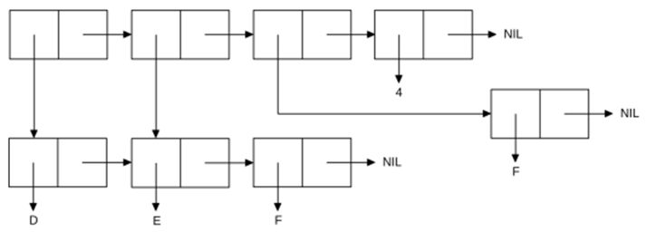

<p align="center"><b>МОНУ НТУУ КПІ ім. Ігоря Сікорського ФПМ СПіСКС</b></p>

<p align="center">
<b>Звіт з лабораторної роботи 1</b><br/>
"Обробка списків з використанням базових функцій"<br/>
дисципліни "Вступ до функціонального програмування"
</p>

<p align="right">Студентка: Щербина Надія Іванівна, КВ-13</p>
<p align="right"> Рік: 2024</p>

## Загальне завдання

### Пункт 1: Створення списку
```lisp
(setq custom-list (list 1 'a (list 'b 'c) ()))
```

### Пункт 2: Отримання голови списку
```lisp
(print (car custom-list))
```

### Пункт 3: Отримання хвоста списку
```lisp
(print (cdr custom-list))
```

### Пункт 4: Отримання третього елемента списку
```lisp
(print (nth 2 custom-list))
```

### Пункт 5: Отримання останнього елемента списку
```lisp
(print (first (last custom-list)))
```

### Пункт 6: Використання ATOM та LISTP
```lisp
(print (atom (car custom-list)))
(print (atom (nth 2 custom-list)))
(print (atom (car (last custom-list))))

(print (listp (car custom-list)))
(print (listp (nth 2 custom-list)))
(print (listp (car (last custom-list))))
```

### Пункт 7: Використання предикатів(eql, null, numberp)
```lisp
(print (eql (car custom-list) 1))
(print (null (nth 3 custom-list)))
(print (numberp (second custom-list)))
```

### Пункт 8: Об'єднання списків
```lisp
(print (append custom-list (nth 2 custom-list)))
```

## Варіант 7

<p align="center">

</p>

### Створення списку за варіантом 7:
```lisp
(defvar list-task nil)
(defvar list-of-task nil)
(setq list-of-task '(d e f) list-task (list list-of-task (rest list-of-task) (list 'f) 4))
(print list-task)

; ((D E F) (E F) (F) 4) 
```


